# Company Brain — Architecture Overview

> AI-native operational knowledge engine: ingest fragmented team communication, extract structured SOPs, govern them with human-in-the-loop controls, and serve executable skills to AI agents via FastMCP.

---

## 1. Overall System Architecture

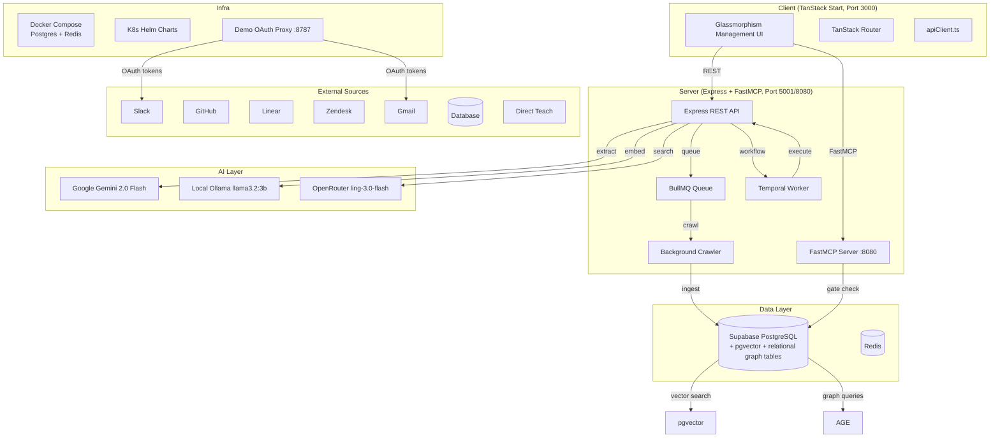

---

## 2. Component Responsibilities

### 2.1 Server (`server/`)

| Component | Path | Responsibility |
|---|---|---|
| **Entrypoint** | `src/index.ts` | Bootstraps Express, FastMCP, BullMQ ingestion worker, Temporal worker, and background crawler in a single process |
| **REST Routes** | `src/routes/` | `ingestion.ts` (webhooks + async crawl jobs), `sops.ts` (CRUD + search + approvals + analytics), `integrations.ts` (OAuth connect/disconnect), `webhooks.ts` (event-driven ingestion), `connectors.ts` (signature verification + workspace resolution) |
| **AI Provider** | `src/services/aiProvider.ts` | Tiered LLM calls: Gemini 2.0 Flash → Ollama llama3.2:3b → OpenRouter ling-3.0-flash |
| **Embeddings** | `src/services/embeddings.ts` | Generates 1536-dim vectors via Ollama `nomic-embed-text`; falls back to deterministic pseudo-vectors |
| **Extractor** | `src/services/extractor.ts` | LLM-powered SOP extraction from thread transcripts; Zod schema validation; graph entity/relationship extraction |
| **Freshness** | `src/services/freshness.ts` | Immutable versioning (`sop_versions`), staleness detection (30-day threshold), pgvector semantic conflict detection |
| **MCP Tools** | `src/services/mcp.ts` | 10 FastMCP tools: `get_sop_by_id`, `search_operational_sops`, `get_sop_with_history`, `request_execution_approval`, `check_approval_status`, `execute_sop_step`, `log_sop_execution`, `run_orchestrated_workflow`, `register_openapi_spec`, `execute_code_sandbox` |
| **Graph** | `src/services/graph/` | `graphService.ts` — node/edge CRUD + DLAC-filtered 2-hop traversal; `entityDisambiguator.ts`; `ontologyCompiler.ts`; `temporalGraphService.ts`; `vectorEntityResolver.ts` |
| **Retrieval** | `src/services/retrieval/` | `hybridSearch.ts` — RRF fusion of dense vector + sparse keyword + GraphRAG; `reranker.ts` — cross-encoder reranking; `groundingGuardrail.ts` — output grounding verification |
| **Skills** | `src/services/skills/` | `sopCompiler.ts` — markdown → executable AST; `openApiAutoDiscoverer.ts` + `openApiCompiler.ts` — OpenAPI spec → FastMCP tools; `sandboxEngine.ts` + `secureSandboxEngine.ts` + `e2bSandboxEngine.ts` — sandboxed code execution; `toolSelfHealer.ts` — auto-retry on failure |
| **Integrations** | `src/services/integrations/` | `http_adapters.ts` — Slack, GitHub, Stripe, Postgres dispatch adapters; `secrets.ts` — AES-256-GCM encrypted credential storage/retrieval |
| **Crawler** | `src/services/crawler.ts` | Periodic background crawl across Slack, GitHub, Linear, Zendesk, Email, Database; calls per-source crawlers in `src/services/crawlers/` |
| **Ingestion** | `src/services/ingestion/` | `webhookService.ts` — HMAC signature verification + incremental dedup |
| **Parsers** | `src/services/parsers/` | `documentParser.ts` — layout-aware routing (PDF → pdf-parse, others → layoutParser); `layoutParser.ts` — markdown table extraction; `pdfExtractor.ts` — real pdf-parse text extraction |
| **Eval** | `src/services/eval/` | `hallucinationEvaluator.ts` — LLM-graded claim-to-source grounding with 0.95 threshold |
| **Security** | `src/services/security/` | `kmsEncryption.ts` — AES-256-GCM envelope encryption; `openfgaClient.ts` — ReBAC tuple store with 60s TTL cache |
| **Config** | `src/config/supabase.ts` | Three Supabase clients: service-role (system), anon (RLS-enforced), tenant (JWT-scoped) |

### 2.2 Workers

| Worker | Path | Responsibility |
|---|---|---|
| **Ingestion Worker** | `src/workers/ingestionWorker.ts` | BullMQ consumer; runs crawl jobs (slack, github, linear, zendesk, email, db, all); concurrency 5; rate limit 100/min; DLQ on 3 retries |
| **Temporal Worker** | `src/workers/temporalWorker.ts` | Temporal.io worker on `companybrain-agent-queue`; runs `agentWorkflow.ts` with activities |
| **Crawler Timer** | `src/services/crawler.ts` | `setInterval`-based periodic crawl cycle (default 1h); also runs on boot |

### 2.3 Client (`client/`)

| Component | Path | Responsibility |
|---|---|---|
| **Router** | `src/router.tsx` | TanStack Router with auto-generated `routeTree.gen.ts` |
| **Root** | `src/routes/__root.tsx` | Root layout with sidebar navigation |
| **Index** | `src/routes/index.tsx` | Main dashboard: SOP library, search, analytics, agent console, graph panel, integrations modal, teach-brain modal |
| **API Client** | `src/services/apiClient.ts` | Typed fetch wrappers for all backend endpoints |
| **SOP Lib** | `src/lib/sops.ts` | SOP type definitions, mock fallback data, API call helpers (fetch, approve, confirm, teach, elicit) |
| **Auth** | `src/lib/sops.ts:getToken()` | Reads `auth_token` from localStorage; falls back to `mock-admin-token` |

### 2.4 Demo OAuth Proxy (`demo-oauth-proxy/`)

Standalone Express service (port 8787) that holds real Slack/Google OAuth `client_secret` values. The main server never sees them. Exposes:
- `GET /config/:provider` — public `client_id` for building authorize URLs
- `POST /exchange/:provider` — exchanges OAuth `code` for tokens using the real secret (guarded by `x-proxy-secret` header)

---

## 3. Module Dependency Graph

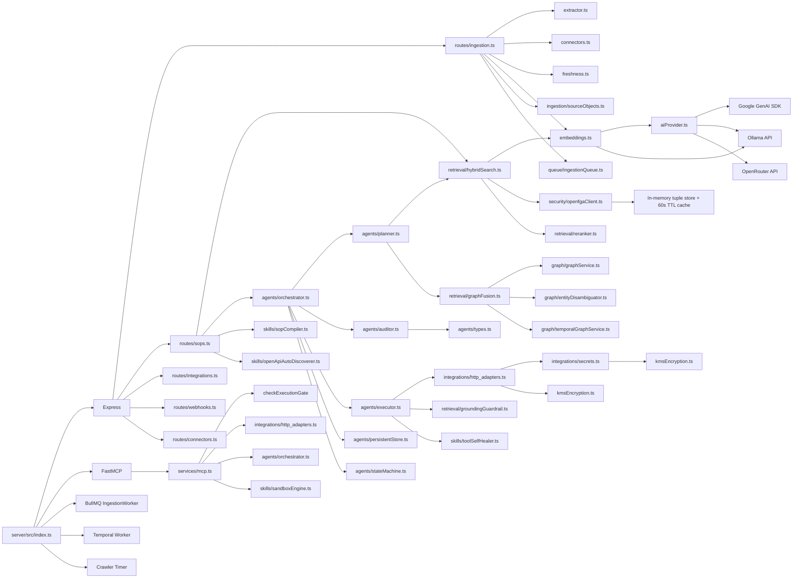

---

## 4. Data Flow

### 4.1 Ingestion Data Flow

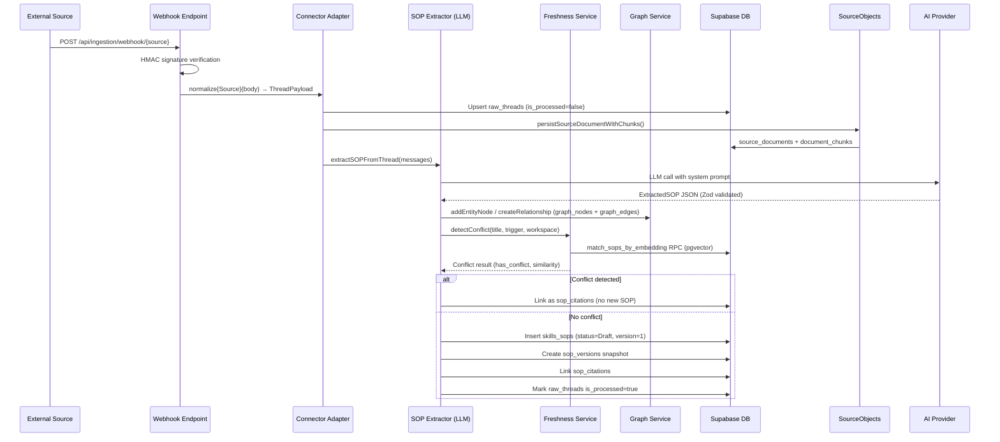

### 4.2 MCP Tool Execution Data Flow

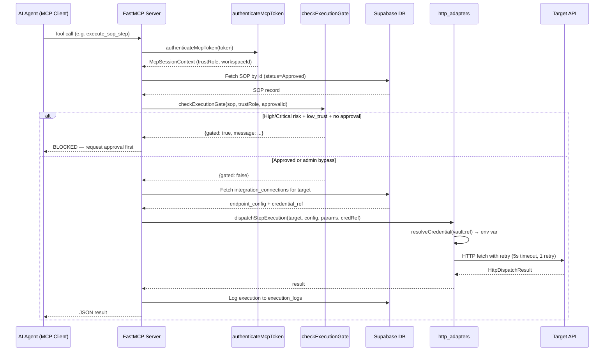

### 4.3 Multi-Agent Workflow Data Flow

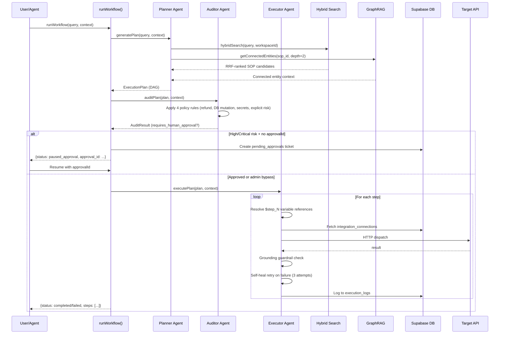

---

## 5. Event Flow

### 5.1 Webhook Event Flow

```mermaid
flowchart TD
    A[External Source POST] --> B{Provider?}
    B -->|Slack| C[verifySlackSignature<br/>HMAC SHA-256]
    B -->|GitHub| D[verifyGitHubSignature<br/>HMAC SHA-256]
    B -->|Linear| E[verifyLinearSignature]
    B -->|Zendesk| F[authenticate middleware]
    B -->|Email| F
    B -->|Database| F
    B -->|Teach| F

    C --> G{Valid?}
    D --> G
    E --> G
    G -->|No| H[401 Unauthorized]
    G -->|Yes| I[resolveWorkspaceMiddleware<br/>map external_org_id → workspace_id]
    I --> J[normalize{Source}(body) → ThreadPayload]
    J --> K{Source Trust}
    K -->|crawled| L[processThread with sourceTrust='crawled']
    K -->|manual| M[processThread with sourceTrust='manual']
    L --> N[Store raw_threads + source_documents]
    M --> N
    N --> O[LLM SOP Extraction]
    O --> P[Conflict Detection via pgvector]
    P -->|Conflict| Q[Link as sop_citations]
    P -->|No Conflict| R[Insert skills_sops Draft + version snapshot]
    R --> S[Mark raw_threads is_processed=true]
```

### 5.3 GitHub Connector Event Flow

The GitHub connector (`server/src/connectors/github/`) is a standalone ingestion path that feeds the same `source_documents` / `document_chunks` pipeline via `persistSourceDocumentWithChunks` (no LLM in the request path).

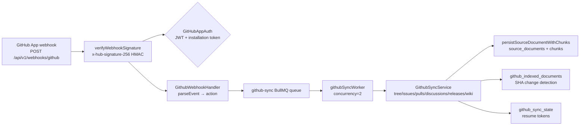

- Webhook events: `push`, `pull_request`, `issues`, `issue_comment`, `discussion`, `discussion_comment`, `release`, `repository` (+ installation lifecycle).
- Admin API mounted at `/api/github` (installations, repositories, sync trigger, sync status).
- Rate limits: 429/403 handling via `Retry-After` / `x-ratelimit-reset`, cursor pagination on all list calls, jittered exponential retries.
- Document metadata: `workspaceId`, `repositoryId`, `repositoryName`, `branch`, `commit`, `author`, `url`, `createdAt`, `updatedAt`, `permissions`, `source`.

### 5.2 BullMQ Ingestion Job Flow

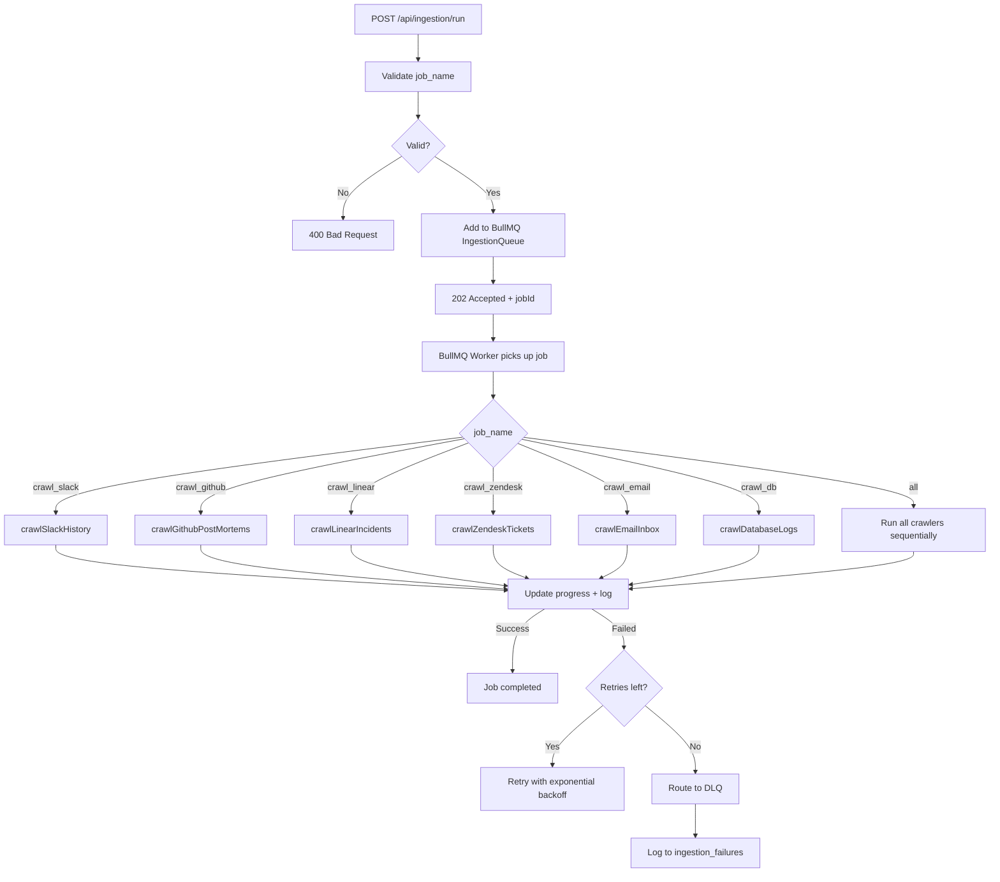

---

## 6. AI Pipeline

```mermaid
flowchart TD
    A[Raw Thread / Document] --> B{Normalization}
    B -->|Slack/GitHub/Linear/Zendesk/Email/DB/Teach| C[Connector Adapter<br/>normalize{Source}]
    C --> D[Unified ThreadPayload]
    D --> E[SOP Extraction via LLM]

    E --> F[System Prompt:<br/>Enterprise Knowledge Engineer]
    F --> G[User Prompt:<br/>Formatted transcript + SOURCE_TRUST]
    G --> H{AI Provider Chain}

    H -->|Tier 1| I[Google Gemini 2.0 Flash<br/>gemini-2.0-flash]
    H -->|Tier 2| J[Ollama llama3.2:3b<br/>localhost:11434]
    H -->|Tier 3| K[OpenRouter ling-3.0-flash<br/>inclusionai/ling-3.0-flash:free]

    I --> L{Zod Schema Validation<br/>ExtractedSOPSchema}
    J --> L
    K --> L

    L -->|Valid + confidence ≥ 0.4| M[ExtractedSOP]
    L -->|Invalid or low confidence| N[Return null<br/>HTTP 200 'no valid SOP']

    M --> O[Graph Entity Extraction]
    O --> P[addEntityNode + createRelationship<br/>graph_nodes + graph_edges]

    M --> Q[Conflict Detection]
    Q --> R[generateEmbedding title+trigger]
    R --> S[match_sops_by_embedding RPC<br/>pgvector HNSW, threshold=0.75]
    S --> T{LLM conflict verification}
    T -->|Duplicate| U[Link as sop_citations]
    T -->|No conflict| V[Proceed to storage]

    V --> W[Generate SOP embedding]
    W --> X[Insert skills_sops Draft + sop_versions]
    X --> Y[Mark raw_threads processed]
```

---

## 7. Knowledge Ingestion Pipeline

The ingestion pipeline supports 7 sources:

| Source | Normalizer | Auth | Trust Level |
|---|---|---|---|
| Slack | `normalizeSlack()` | HMAC signature + workspace resolution | `crawled` |
| GitHub | `normalizeGitHub()` | HMAC signature + installation resolution | `crawled` |
| Linear | `normalizeLinear()` | HMAC signature + org resolution | `crawled` |
| Zendesk | `normalizeZendesk()` | JWT auth (member+) | `crawled` |
| Email | `normalizeEmail()` | JWT auth (member+) | `crawled` |
| Database | `normalizeDatabase()` | JWT auth (member+) | `crawled` |
| Direct Teach | `normalizeDirectTeach()` | JWT auth (member+) | `manual` |

**Processing steps for each source:**
1. **Normalize** → `ThreadPayload` (workspace_id, source, external_thread_id, channel_or_project, messages)
2. **Persist raw** → `raw_threads` table + `source_documents` + `document_chunks` (chunked at 3000 chars with 250 char overlap)
3. **Extract SOP** → LLM call with `SOURCE_TRUST` context; Zod schema validation; confidence threshold 0.4
4. **Detect conflict** → pgvector embedding search (threshold 0.75) + LLM verification
5. **Store** → `skills_sops` (status=Draft, version=1) + `sop_versions` snapshot + `sop_citations` link
6. **Graph** → Extract entities/relationships → `graph_nodes` + `graph_edges` (relational system of record)

---

## 8. Database Schema

### Core Tables (Supabase PostgreSQL)

```mermaid
erDiagram
    skills_sops {
        uuid id PK
        text workspace_id
        text title
        text category
        text status "Draft|Approved"
        text trigger_condition
        text preconditions
        jsonb execution_steps
        jsonb sop_ast
        text source_doc_id
        int version
        timestamptz last_confirmed_at
        boolean is_stale
        text risk_level "Low|Medium|High|Critical"
        boolean requires_human_gate
        text trust_role_required
        vector(1536) embedding
        timestamptz created_at
        timestamptz updated_at
    }

    sop_versions {
        uuid id PK
        uuid sop_id FK → skills_sops
        int version_number
        text changed_by
        text change_reason
        jsonb snapshot
        timestamptz created_at
    }

    raw_threads {
        uuid id PK
        text workspace_id
        text source "slack|github|linear|zendesk|email|database|direct_teach"
        text external_thread_id
        text channel_or_project
        jsonb raw_content
        boolean is_processed
        timestamptz created_at
    }

    sop_citations {
        uuid id PK
        uuid sop_id FK → skills_sops
        uuid raw_thread_id FK → raw_threads
    }

    pending_approvals {
        uuid id PK
        uuid sop_id FK → skills_sops
        text agent_id
        text requested_by
        text risk_level
        text status "pending|approved|rejected"
        text reason
        jsonb execution_context
        timestamptz created_at
        timestamptz resolved_at
        timestamptz consumed_at
    }

    graph_nodes {
        text id PK
        text label "Person|System|SOP|Rule|Step|Entity|Policy|Team|Role"
        text name
        jsonb properties
        text workspace_id
        text[] allowed_roles
        text source_document_id
        timestamptz created_at
    }

    graph_edges {
        uuid id PK
        text source_id FK → graph_nodes
        text target_id FK → graph_nodes
        text edge_type "OWNS|REQUIRES|MODIFIES|DEPENDS_ON|EXECUTES|HAS_STEP|REQUIRES_ROLE|TARGETS_SYSTEM|SUPERSEDES|GOVERNED_BY"
        jsonb properties
        text workspace_id
        text[] allowed_roles
        text source_document_id
        timestamptz valid_from
        timestamptz valid_until
        timestamptz created_at
    }

    integration_credentials {
        uuid id PK
        text workspace_id
        text provider
        text external_org_id
        text access_token_encrypted
        text refresh_token_encrypted
        text[] scopes
        uuid connected_by_user_id FK → auth.users
        timestamptz connected_at
        text status "connected|revoked|error"
    }

    integration_installations {
        uuid id PK
        text workspace_id
        text provider
        text external_org_id
    }

    platform_oauth_config {
        text provider PK "slack|github|gmail"
        text client_id
        text client_secret_encrypted
        jsonb extra_config
        uuid configured_by_user_id FK → auth.users
        timestamptz updated_at
    }

    oauth_state_nonces {
        text nonce PK
        text workspace_id
        text provider
        timestamptz expires_at
    }

    execution_logs {
        uuid id PK
        uuid sop_id FK → skills_sops
        text agent_id
        text tool_name
        jsonb input_params
        text outcome
        timestamptz created_at
    }

    ingestion_failures {
        uuid id PK
        text workspace_id
        text source
        text raw_content
        text error_message
        timestamptz created_at
    }

    webhook_subscriptions {
        uuid id PK
        text workspace_id
        text provider
        text webhook_secret
        text last_delivery_token
        timestamptz last_event_timestamp
        timestamptz created_at
    }

    document_permissions {
        uuid id PK
        uuid sop_id FK → skills_sops
        uuid user_id FK → auth.users
        text min_role
        timestamptz created_at
    }

    user_workspace_roles {
        uuid user_id PK FK → auth.users
        text workspace_id
        text role "admin|approver|member"
        timestamptz created_at
    }

    agent_registry {
        uuid id PK
        text token
        text agent_id
        text workspace_id
        text trust_role "low_trust|high_trust|admin"
        timestamptz created_at
    }

    integration_connections {
        uuid id PK
        text workspace_id
        text integration_name
        jsonb endpoint_config
        text credential_ref
        timestamptz created_at
    }

    source_documents {
        uuid id PK
        text workspace_id
        text source
        text source_key
        text external_id
        text title
        text content_hash
        uuid raw_thread_id FK → raw_threads
        jsonb raw_metadata
        timestamptz created_at
    }

    document_chunks {
        uuid id PK
        uuid source_document_id FK → source_documents
        int chunk_index
        text content
        text content_hash
        jsonb metadata
        vector(1536) embedding
        text[] allowed_roles
        text workspace_id
        timestamptz created_at
    }
```

### Migration Order (applied manually in Supabase SQL Editor)

Migrations are applied in filename order. Key schema evolution:

| Migration | Purpose |
|---|---|
| `create_skills_sops.sql` | Core SOP table |
| `create_raw_threads_and_citations.sql` | Raw thread storage + citation links |
| `003_versioning_and_logs.sql` | `sop_versions`, `execution_logs` |
| `004_enterprise_guardrails_and_rbac.sql` | `risk_level`, `requires_human_gate`, `pending_approvals` |
| `005_ingestion_failures_and_embeddings.sql` | `ingestion_failures`, `embedding vector(1536)`, `match_sops_by_embedding` RPC |
| `006_crawled_sources_table.sql` | `crawled_sources` dedup tracking |
| `007_tool_registry.sql` | `integration_connections` with seeded defaults |
| `008_rls_hardening_and_vector_precision.sql` | RLS hardening, DLAC vector search RPC |
| `009_agent_registry.sql` | `agent_registry` with seeded test tokens |
| `010_single_use_approvals.sql` | `consumed_at` column on `pending_approvals` |
| `011_remove_workspace_bypass.sql` | Remove workspace bypass |
| `012_integration_installations.sql` | `integration_installations` + demo seed data |
| `013_rls_hardening_remaining_tables.sql` | RLS on remaining tables |
| `014_user_workspace_roles.sql` | `user_workspace_roles` with RLS |
| `015_custom_access_token_hook.sql` | Supabase Auth hook injecting `role` + `workspace_id` into JWT |
| `016_integration_credentials.sql` | `integration_credentials` with encrypted tokens |
| `017_oauth_state_nonces.sql` | CSRF state nonce table |
| `018_platform_oauth_config.sql` | Platform-level OAuth config with encrypted secrets |
| `021_dlac_vector_search_function.sql` | `document_permissions` + `match_embeddings_dlac` RPC |
| `022_apache_age_graph_schema.sql` | Relational knowledge graph tables (`graph_nodes` + `graph_edges`) |
| `023_add_fulltext_search_index.sql` | Full-text search indexes |
| `024_webhook_subscriptions.sql` | `webhook_subscriptions` for incremental sync |
| `025_dlac_hnsw_prefilter.sql` | DLAC HNSW pre-filter optimization |
| `026_temporal_graph_schema.sql` | Temporal graph schema |
| `027_source_documents_chunks_and_schema_repairs.sql` | `source_documents` + `document_chunks` tables |
| `028_fix_migration_order.sql` | Fix migration ordering issues |
| `030_github_connector.sql` | GitHub connector: `github_repositories`, `github_sync_state`, `github_indexed_documents` (RLS, SHA-based change detection) |

---

## 9. Worker Architecture

### 9.1 BullMQ Ingestion Worker

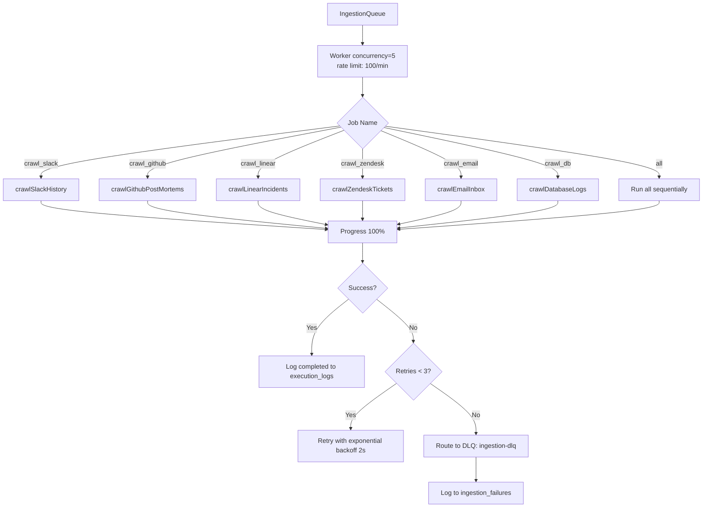

### 9.2 GitHub Sync Worker

`githubSyncWorker` (started by `startGithubSyncWorker()`, also spawnable via `bootstrap.ts` process `github-sync-worker`) consumes the `github-sync` queue:

- `sync_installation` — list installations → upsert `github_repositories` → enqueue `sync_repository` (initial) per repo with 500ms stagger.
- `sync_repository` — run `GithubSyncService.syncRepository` (initial or incremental via `GithubSyncKind`); resume tokens checkpointed to `github_sync_state` every 5s / on phase completion; retries 3 with 2s exponential backoff.
- `webhook_event` — `GithubWebhookHandler.handleEvent` (signature already verified at the route; installation mapping via `resolveWorkspaceForWebhook`).
- All job outcomes audited to `execution_logs` / failures to `ingestion_failures`.

### 9.3 Temporal Agent Workflow

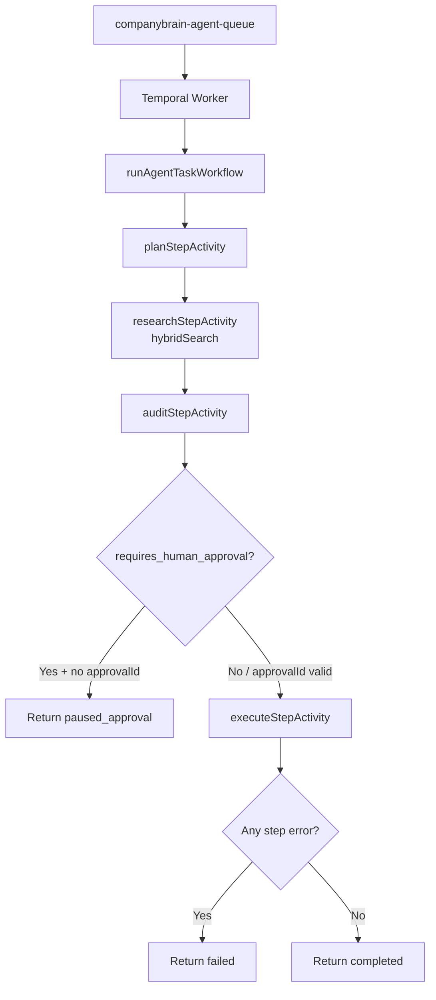

### 9.4 Background Crawler

- Runs on server boot (`startCrawlerWorker()`)
- `setInterval` with configurable `CRAWL_INTERVAL_MS` (default 1 hour)
- Each cycle: crawl all sources → mark stale SOPs (30-day threshold)
- Gmail crawl requires connected `integration_credentials` with `status=connected`

---

## 10. Authentication Flow

### 10.1 Supabase Auth + Custom Access Token Hook

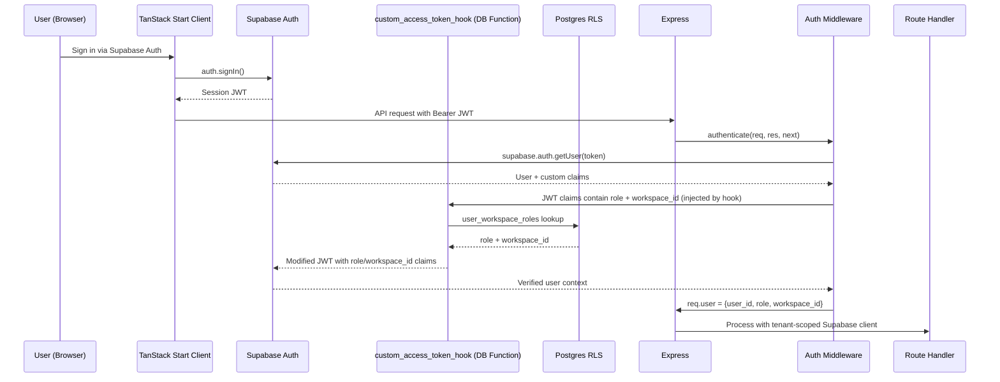

### 10.2 FastMCP Token Authentication

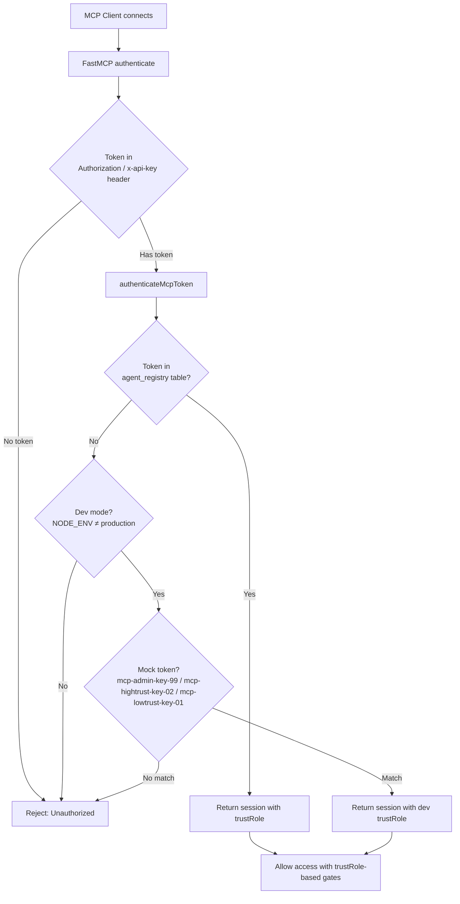

### 10.3 Execution Gate (Human-in-the-Loop)

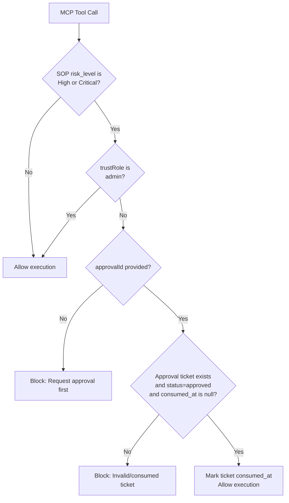

---

## 11. Deployment Architecture

### 11.1 Local Development (Docker Compose)

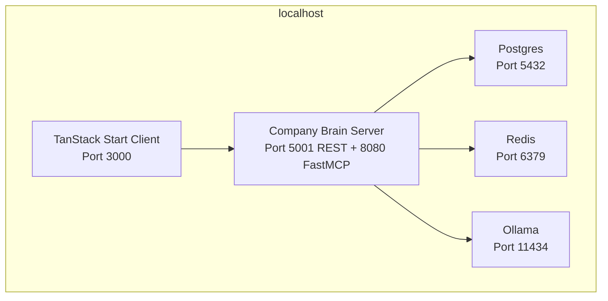

Run: `docker compose up -d`

### 11.2 Kubernetes (Helm)

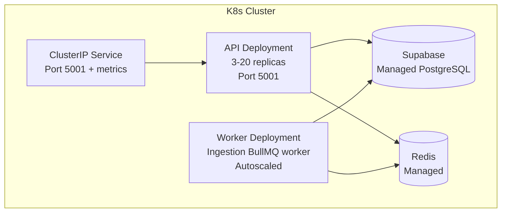

Helm values: `replicaCount: 3`, autoscaling `minReplicas: 3`, `maxReplicas: 20`, `targetCPUUtilization: 75%`

### 11.3 Environment Variables

| Variable | Purpose | Required |
|---|---|---|
| `SUPABASE_URL` | Supabase project URL | Yes |
| `SUPABASE_SERVICE_ROLE_KEY` | Service role key for server-side DB access | Yes |
| `SUPABASE_ANON_KEY` | Anon key for RLS-enforced tenant clients | Yes |
| `VAULT_SECRET_KEY` | 32-byte hex key for AES-256-GCM encryption | Yes |
| `OPENROUTER_API_KEY` | OpenRouter API key for LLM calls | Yes |
| `GEMINI_API_KEY` | Google AI Studio key (primary LLM) | Optional |
| `OLLAMA_HOST` | Ollama server URL (default `http://localhost:11434`) | Optional |
| `REDIS_URL` | Redis connection URL (default `redis://localhost:6379`) | Yes for workers |
| `DATABASE_URL` | Direct Postgres connection for adapters | Optional |
| `PORT` | Express port (default `5001`) | No |
| `APP_BASE_URL` | Server base URL for OAuth redirects | No |
| `CLIENT_BASE_URL` | Client URL for OAuth callback redirects | No |
| `TEMPORAL_ADDRESS` | Temporal server address (default `localhost:7233`) | Optional |
| `DEMO_PROXY_URL` | Demo OAuth proxy URL | Optional |
| `DEMO_PROXY_SHARED_SECRET` | Shared secret for demo proxy auth | Optional |

---

## 12. Current Limitations

The following limitations are documented in `COMPANY_BRAIN_CRITICAL_REVIEW.md` and verified in the codebase:

### 12.1 Ingestion Gaps
- **Notion**: No connector, parser, sync state, or page/database handling
- **Confluence**: No connector, CQL, spaces/pages, attachments, permissions, or version history
- **Email crawler**: Queries snippets only, not full MIME bodies, attachments, Outlook labels, ACLs, or delta sync
- **Slack crawler**: Targets one channel default; only parent messages with `reply_count >= 3`; no enterprise grid, private channels, file attachments, Slack Connect, or permission mirroring
- **GitHub crawler**: No GitHub App token exchange for API crawl, code search, PR review threads, repos enumeration, org mapping, branch protections, Actions logs, or permissions

### 12.2 AI Pipeline Gaps
- **Graph**: Relational `graph_nodes` + `graph_edges` are the system of record (Apache AGE retired in Phase 0); traversal + workspace scoping covered by `server/src/graph/algorithms.ts`
- **OpenAPI skills**: `register_openapi_spec` returns `compiled_skill_dispatched` without real authenticated API execution
- **Embeddings**: Fallback to deterministic pseudo-vectors when Ollama is offline; no real vector similarity in test environments
- **Grounding guardrail**: Heuristic-based; LLM judge can fail closed on errors, blocking all execution

### 12.3 Security Gaps
- **OpenFGA**: In-memory tuple store only; no real OpenFGA server integration; `getUserAccessibleDocumentIds` iterates all tuples
- **ABAC middleware**: `allowedIpRanges` uses substring matching (`clientIp.includes(range)`), not CIDR validation
- **Demo mode**: Hardcoded mock tokens and demo credentials in production code paths

### 12.4 Operational Gaps
- **No CI/CD**: No GitHub Actions workflows, no pre-commit hooks
- **No test framework**: All tests are custom console runners via `tsx`; no automated test orchestration
- **No typecheck script**: Server has `npm run build` (tsc) but no dedicated `typecheck` script; client has no typecheck script either
- **Server has no lint**: Only the client has `npm run lint`
- **Single-process boot**: All workers (Express, FastMCP, BullMQ, Temporal, Crawler) start in one process; no process isolation

---

## 13. Technical Debt

| Area | Issue | Impact |
|---|---|---|
| **Graph** | Apache AGE retired (Phase 0); relational `graph_nodes`/`graph_edges` are the system of record | Traversal is RPC-free; TS graph algorithms in `server/src/graph/algorithms.ts` |
| **Skills** | OpenAPI auto-discovery returns `compiled_skill_dispatched` without real execution | No actual tool execution from specs |
| **Tests** | No test framework; tests hit live services; ioredis retries forever without Redis | Tests hang or false-pass in CI |
| **Embeddings** | Deterministic pseudo-vectors as fallback | Zero similarity in offline/test mode |
| **OpenFGA** | In-memory tuple store; no real PDP server | ReBAC is effectively disabled in production |
| **ABAC** | IP range check uses substring match, not CIDR | Security policy bypass possible |
| **Migrations** | Manual Supabase SQL Editor application; no automated migration runner | Human error in ordering; migration 028 exists to fix ordering issues |
| **Auth** | Mock tokens (`mock-admin-token`) work in dev but are forbidden in production | Dev/prod auth gap |
| **Single process** | All workers in one Node.js process | No resource isolation; one crash kills everything |
| **No CI** | No automated testing, linting, or deployment pipelines | Manual deployment only |

---

## 14. Enterprise Readiness Assessment

| Dimension | Status | Notes |
|---|---|---|
| **SOP Extraction** | Prototype | LLM extraction works but confidence scoring is heuristic; low-confidence SOPs are silently dropped |
| **Governance** | Partial | Draft → Approved workflow exists; human-in-the-loop gates for High/Critical risk; versioning is immutable |
| **Freshness** | Partial | 30-day staleness sweep exists; no automated re-extraction or change detection from source |
| **Retrieval** | Prototype | RRF hybrid search works; grounding guardrail is heuristic and can fail-closed |
| **Execution** | Prototype | HTTP adapters for Slack, GitHub, Stripe, Postgres exist; vault, admin_cli, zendesk return unsupported errors |
| **Auth** | Partial | Supabase Auth + Custom Access Token Hook + RLS; FastMCP token auth is basic; no SSO/SAML |
| **Multi-tenancy** | Partial | Workspace-scoped RLS; tenant client with JWT; but `DEV_SEED_WORKSPACE_ID` guard is the only prod safety net |
| **Observability** | Partial | OpenTelemetry tracing on BullMQ/Temporal; Prometheus `/metrics`; execution_logs audit table; no dashboard |
| **Scalability** | Low | Single-process boot; BullMQ concurrency 5; no horizontal scaling of workers; Temporal not integrated with main process |
| **Security** | Partial | AES-256-GCM encryption for credentials; RLS policies; ABAC middleware; but OpenFGA is in-memory only; IP range check is substring-based |
| **DevOps** | Low | No CI/CD; manual migration application; Helm charts exist but are minimal; no automated testing pipeline |

**Verdict**: The product has credible scaffolding for the right nouns (ingestion, SOP extraction, freshness, vector search, graph, MCP, approval gates) but is a prototype. Most enterprise-grade subsystems are shallow, hardcoded, simulated, or unintegrated. It is not ready for enterprise deployment without significant additional work on execution depth, security hardening, operational automation, and scalability.
