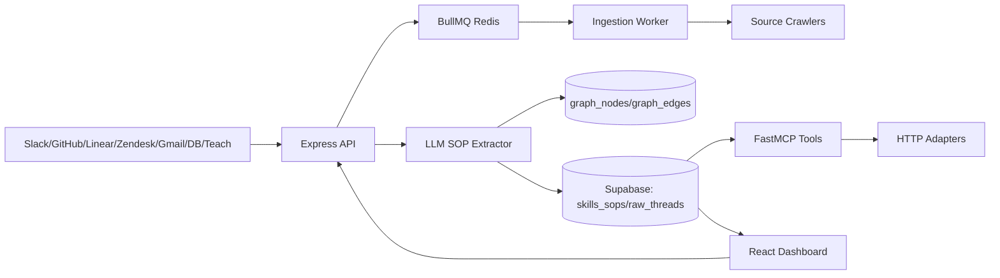
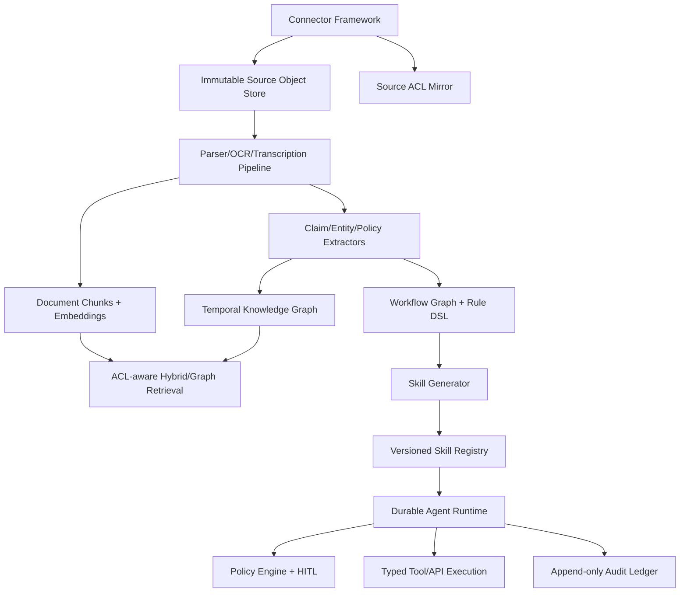
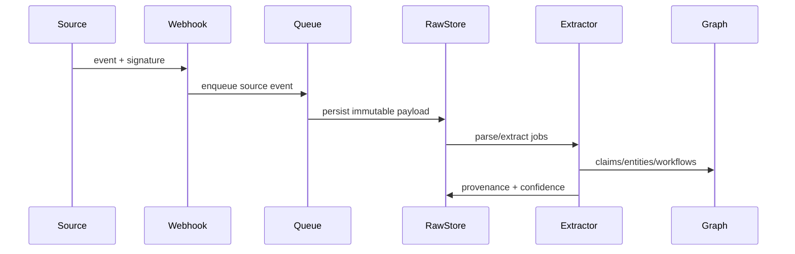
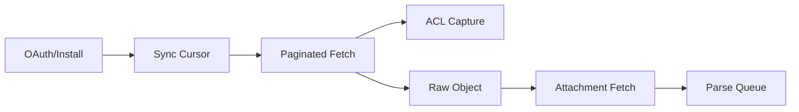
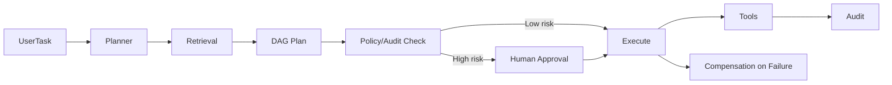
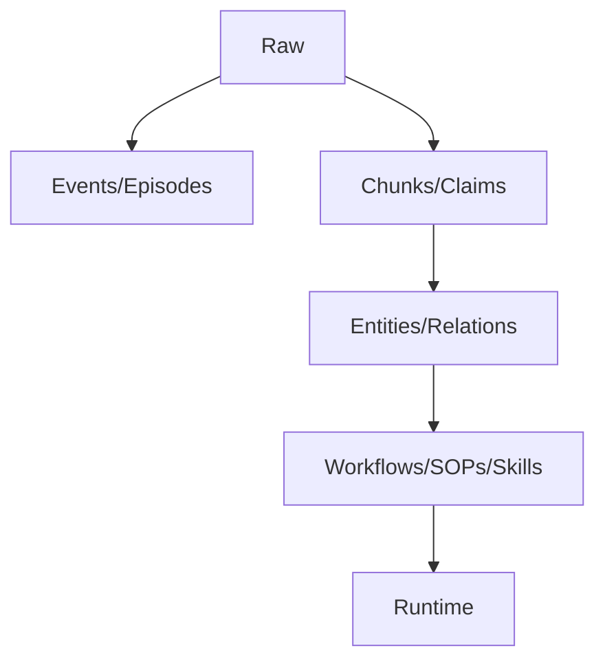
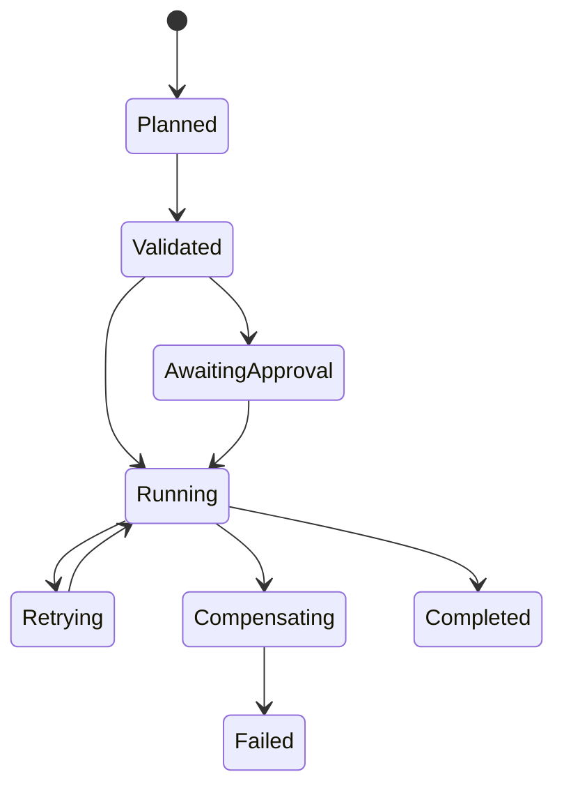

# Company Brain Critical Technical Review

Date: 2026-08-04

Verdict: this is not yet a Company Brain. It is an early SOP extraction and governance demo with useful scaffolding around ingestion, Supabase persistence, MCP, graph tables, and approval gates. It does not yet solve the enterprise domain-knowledge bottleneck. Evaluated as a YC/OpenAI/Anthropic/Microsoft/Stripe/Fortune 500 diligence package, I would reject in its current state unless there is exceptional customer evidence not present in this repo.

## Evidence Base

Reviewed custom source, migrations, docs, deployment files, tests, and frontend code. Ignored generated lockfiles and stock UI components for product judgment. Verification:

- `server npm run build`: passed.
- `client npm run build`: passed.
- `server npm test`: interrupted after >60s because Redis was unavailable and ioredis kept retrying. Many smoke tests had already "passed" despite zero graph traversal or zero search results, which weakens test confidence.

Key files proving the current implementation:

- Ingestion: `server/src/routes/ingestion.ts`, `server/src/services/connectors.ts`, `server/src/services/crawler.ts`, `server/src/workers/ingestionWorker.ts`.
- Extractor: `server/src/services/extractor.ts`.
- Freshness/versioning: `server/src/services/freshness.ts`.
- Retrieval: `server/src/services/retrieval/hybridSearch.ts`, `graphFusion.ts`, `reranker.ts`, `groundingGuardrail.ts`.
- Graph: `server/src/services/graph/*.ts`, `server/supabase/022_apache_age_graph_schema.sql`.
- Agents: `server/src/agents/*.ts`, `server/src/workflows/*.ts`.
- Skills/MCP: `server/src/services/mcp.ts`, `server/src/services/skills/*.ts`.
- Security/RBAC: `server/src/middleware/*.ts`, `server/src/services/security/*.ts`, `server/supabase/*.sql`.
- Frontend: `client/src/routes/index.tsx`, `client/src/lib/sops.ts`, `client/src/components/*`.

## Executive Verdict

The product vision is strong and the repo demonstrates credible awareness of the right nouns: ingestion, SOP extraction, freshness, vector search, graph, MCP, approval gates, DLAC, OpenFGA, Temporal, BullMQ, sandboxing. But the implementation is a prototype. Almost every enterprise-grade subsystem is either shallow, hardcoded, simulated, unintegrated, or schema-inconsistent.

The most damaging issue: it optimizes around extracting SOPs from a few sources, not constructing a continuously updated operational knowledge substrate. A true Company Brain needs source-level ACL preservation, document chunk lineage, canonical entity resolution, temporal graph updates, workflow mining, policy learning, confidence/eval loops, connector sync state, and safe action execution. This repo has partial sketches, not working depth.

## Step 1: Project Understanding

Current architecture:

- Express API starts REST routes, FastMCP, crawler timer, BullMQ worker, and Temporal worker from one process in `server/src/index.ts`.
- Supabase is the main database and auth layer. It stores SOPs, raw threads, citations, versions, approvals, graph nodes/edges, credentials, installations, and agent tokens.
- Ingestion accepts normalized Slack/GitHub/Linear/Zendesk/Email/Database/Teach thread payloads, calls an LLM extractor, inserts `skills_sops`, links `sop_citations`, and creates version snapshots.
- Background crawlers poll selected Slack/GitHub/Linear/Zendesk/Gmail/database sources and create SOPs.
- Retrieval combines pseudo/real embeddings, `ILIKE` keyword search, simple graph matching, RRF, and a term-overlap reranker.
- Graph is primarily relational fallback tables `graph_nodes` and `graph_edges`; Apache AGE is enabled in SQL but not actually used by app logic except a dead `executeCypher` RPC path.
- Agent runtime is planner -> auditor -> executor. Planner uses LLM plus top SOP context. Auditor is keyword/risk rules. Executor dispatches to Slack/GitHub/Stripe/Postgres adapters or returns unsupported target errors.
- Skills are exposed over FastMCP. OpenAPI "skills" are registered but only return `compiled_skill_dispatched`; they do not perform real authenticated API execution.
- Frontend is an operational dashboard with mock fallback data, SOP library, approvals, ingestion trigger, graph panel, integrations modal, and agent console.

## Step 2: Capability Review Against Ideal Company Brain

### Knowledge Ingestion

Email: partially exists. Gmail OAuth and crawler exist in `email.ts`, but it queries snippets only, not full MIME bodies, attachments, Outlook, labels, ACLs, threading, or delta sync.

Slack: partially exists. Webhook and crawler exist, but crawler targets one channel default and only parent messages with reply_count >= 3. No enterprise grid, private channel handling, file attachments, Slack Connect, user/team mapping, edits/deletes, or permission mirroring.

GitHub: partially exists. Issues endpoint exists and crawler reads closed issues with labels. No GitHub App token exchange for API crawl, code search, PR review threads, repos enumeration, org mapping, branch protections, Actions logs, files, or permissions.

Notion: missing. No connector, parser, sync state, page/database handling, comments, permissions, or block model.

Confluence: missing. No connector, CQL, spaces/pages, attachments, permissions, or version history.

Jira: missing. Linear exists; Jira/Atlassian does not.

Linear: partially exists. GraphQL crawler pulls completed P0/P1 issues. No OAuth, comments pagination, teams enumeration, webhooks fully normalized, projects/cycles/documents, or ACLs.

Google Drive: missing. No Drive connector, Docs/Sheets/Slides/PDF crawl, ACLs, file revisions, or change tokens.

Dropbox: missing.

SharePoint: missing. No Microsoft Graph Drive/Sites/Lists integration.

CRM: missing. Stripe execution adapter exists, but no Salesforce/HubSpot CRM ingestion.

PDFs: partially exists. Parser uses `pdf-parse`; no ingestion route for files and no OCR.

Word docs: missing. No docx parser.

Call recordings: missing. No audio ingestion, transcription, diarization, speaker mapping, or consent controls.

Internal databases: very weak. `database.ts` uses two hardcoded sample query logs; no introspection, CDC, schema crawl, query log ingestion, secrets flow, or row-level policy mapping.

APIs: partially exists. OpenAPI compiler exists, but no sync runtime and no authenticated production dispatch for compiled tools.

Suggested implementation: build a connector framework with `Connector`, `SyncCursor`, `SourceObject`, `SourceAcl`, `SourceDelta`, `Attachment`, `Chunk`, and `SourceEvent` interfaces; implement OAuth/token refresh; preserve source ACLs; use queues per source; store raw immutable source objects before extraction; add incremental sync and backfill.

### Knowledge Processing

OCR: missing. `pdfExtractor.ts` explicitly returns `scanned_ocr_required`.

PDF parsing: partial text only; weak layout/table extraction.

Spreadsheet parsing: partial via `xlsx`; no formula extraction, named ranges, metadata, or sheet ACLs.

Entity extraction: partial via LLM in `extractor.ts`, constrained to Person/System/SOP/Rule/Step/Entity.

People/teams: weak. Person and Team types exist in ontology, but extraction schema omits Team and no directory integration exists.

Workflows: weak. Extracts `execution_steps`; does not mine actual workflows across systems/events.

Business rules/decision trees: weak. Trigger/preconditions/steps exist, no formal rule engine or branching semantics beyond optional step condition.

SOP extraction: partial. This is the core working demo.

Dependencies: partial graph relationships only, model-generated without validation against real systems.

Duplicate detection: partial vector + LLM conflict check in `freshness.ts`; no canonical merge workflow.

Outdated detection: weak. Age-based staleness only; no source-change invalidation or contradiction detection.

Versioning: partial. `sop_versions` snapshots exist; source object versioning and graph versioning are missing.

Suggested implementation: introduce document chunking, layout/OCR pipeline, structured extraction jobs, entity resolver, workflow miner, rule compiler, confidence/provenance ledger, contradiction/staleness detectors, and human review queues.

### Knowledge Representation

Knowledge graph: partial relational node/edge tables; AGE mostly unused.

Semantic graph: missing. No embeddings on entities/edges, no graph embeddings, no canonical ontology evolution.

Workflow graph: missing. SOP steps are JSON arrays; no DAG schema, transitions, compensation, decision nodes.

Ontology: partial allowlists in `ontologyCompiler.ts`, but no versioned ontology model or domain-specific types.

Entity relationships: partial, LLM-generated and stored.

Document lineage: partial `sop_citations` from raw threads; missing chunk/document provenance and source object lineage.

Provenance: weak. Citations link SOP to raw thread only; no per-claim/per-step provenance.

Confidence scores: extraction has confidence, but `skills_sops` does not store it.

Temporal history: partial `sop_versions`, `valid_from/valid_until` on graph_edges only.

Suggested implementation: add `source_documents`, `document_chunks`, `knowledge_claims`, `claim_evidence`, `entities`, `relationships`, `workflow_nodes`, `workflow_edges`, `policies`, confidence and temporal tables.

### Company Memory

Long-term memory: partial, SOP persistence.

Episodic memory: weak, execution logs and raw threads only.

Semantic memory: partial embeddings on SOPs; no document chunk store migration despite `document_chunks` references.

Procedural memory: partial SOPs.

Retrieval optimization: weak. Uses pgvector RPC if available, but fallback returns arbitrary sliced SOPs with fake similarity.

Hybrid search: partial. Dense + sparse + graph exists, but sparse uses `ILIKE` despite FTS migration, reranker is term overlap, not cross-encoder.

Graph traversal: partial. 1-2 hop relational traversal; workspace scoping missing in `getConnectedEntities` edge query.

Suggested implementation: separate memory types, add chunk store and ACL-aware hybrid retrieval, graph-enhanced query planning, reranker service, source-grounded answer synthesis, and feedback learning.

### AI Skills Generation

Executable workflows: partial AST compiler; no durable executable workflow DSL.

Agent skills: partial MCP tools and OpenAPI registration.

Playbooks/SOPs: partial extraction.

Reusable tools/API wrappers: partial OpenAPI compiler; generated tools do not execute.

Business rules/action graphs: mostly missing.

Suggested implementation: generate versioned skill packages with schemas, required credentials, dry-run mode, idempotency, rollback, tests, evals, permissions, and approval policies.

### Agent Runtime

Plan: partial.

Reason: weak; LLM planner plus fallback.

Clarification: partial `/api/ingestion/interview`; agent runtime itself does not ask clarification.

Execute tools/APIs: partial; Slack/GitHub/Stripe/Postgres only, many simulated dev paths.

Recover/retry: weak; one HTTP retry plus heuristic code self-healing.

Escalate humans: partial approvals.

Audit decisions: partial logs, but schema mismatch exists.

Suggested implementation: use a durable workflow engine properly, explicit tool contracts, idempotency keys, run ledger, state checkpoints, retries, compensation, policy checks, and human escalation APIs.

### Multi-Agent Architecture

Planner: partial.

Researcher: missing as independent agent; Temporal activity calls search but does not feed results into planner.

Execution agent: partial.

Reviewer/auditor: partial keyword rules.

Orchestrator/supervisor: partial.

Memory manager: missing.

Suggested implementation: define agent roles as services with shared state, observation model, task graph, evaluation, and least-privilege tool access.

### Enterprise Features

RBAC: partial Supabase role claims.

ABAC: middleware exists but not wired into main routes.

Permissions: partial RLS and in-memory OpenFGA; no source ACL fidelity.

SSO: missing except Supabase Auth assumption.

Audit logs: partial, inconsistent schema usage.

Compliance/SOC2/GDPR/HIPAA: mostly missing. No retention, DSR, data residency, BAA model, DLP, legal hold, or audit export.

Encryption: partial AES-GCM, but hardcoded dev fallback and no real KMS.

Secrets: partial encrypted integration credentials; execution adapters mostly resolve env vars.

Rate limiting: partial Express rate limits and BullMQ limiter.

Observability: partial in-memory metrics and Prometheus text; no OpenTelemetry exporter.

Tracing/metrics/monitoring: weak.

Suggested implementation: tenant isolation, real IdP/SCIM, source ACL mirroring, OpenFGA service, audit log append-only design, KMS, secret rotation, DLP, retention, SIEM export, OTel, SLOs.

### Infrastructure

PostgreSQL schema: partial and inconsistent. Missing `document_chunks`; `crawled_sources.workspace_id` policy references nonexistent column; `execution_logs` used with columns not in original migration.

Vector storage: partial SOP vector only; no chunk vectors migration.

Graph database: partial AGE enablement, app uses relational fallback.

Queue system: partial BullMQ but Redis unavailable made tests hang.

Event bus: missing.

Caching: partial in-memory/Redis state.

Horizontal scaling: weak. Single process starts API, MCP, crawler, workers, and Temporal worker; unsafe for replicas.

Worker architecture: partial but crawl functions default to demo workspace/source.

Kubernetes: partial Helm templates, no secrets, ingress, HPA template, worker command separation, migrations, Redis/Postgres dependencies, or MCP service.

Cloud deployment/CI/CD/DR: missing.

Suggested implementation: split API, MCP, crawler, ingestion workers, Temporal workers; add migrations, schema tests, infra manifests, Redis/Postgres managed services, object storage, and DR.

### AI Architecture

RAG: partial on SOPs.

GraphRAG: weak; graph context is string matching.

Agentic RAG: partial planner retrieval.

Memory architecture: weak.

Prompt management: prompts inline in code.

Evaluation pipeline: weak LLM judge and smoke tests only.

Hallucination mitigation: partial grounding guardrail, not applied consistently.

Grounding/citations: weak; per-step citations missing.

Tool selection: weak target_system string matching.

Context optimization/model routing: partial but not integrated with `aiProvider.ts`; `modelRouter.ts` exists separately.

Suggested implementation: prompt registry, eval datasets, trace collection, retrieval evals, citation enforcement, model routing, uncertainty/clarification, tool planner constraints, and grounding at claim/action level.

## Competitive Comparison

OpenAI Deep Research / Claude: far stronger deep retrieval, synthesis, uncertainty handling, citations, and browsing/tool reasoning. This project lacks robust source understanding and evals.

Microsoft Graph: massively stronger identity, permissions, mail/calendar/files/SharePoint/Teams integration, delta sync, and compliance.

Google NotebookLM: stronger document-grounded QA over source corpora; Company Brain aims beyond QA but does not yet deliver execution-grade memory.

Glean/Sana AI: much stronger connectors, ACLs, enterprise search relevance, admin controls, and deployment maturity.

Hebbia/Harvey: stronger domain-specific document extraction, review workflows, citation grounding, and enterprise buyer trust.

Dust: stronger agent/workflow productization and tool integration ergonomics.

Palantir AIP: far stronger ontology, action controls, auditability, enterprise integration, and operational deployment.

LangGraph/CrewAI/AutoGen: this repo uses custom lightweight orchestration; it lacks mature state handling, branching, durable supervision, and tool execution patterns those ecosystems provide.

## Step 3: 100-Feature Gap Analysis

| # | Feature | Status | Priority | Difficulty | Why it matters |
|---|---|---|---|---|---|
| 1 | Slack OAuth | Partial | P0 | M | Needed for real workspaces |
| 2 | Slack historical crawl | Partial | P0 | M | One channel is insufficient |
| 3 | Slack private channels | Missing | P0 | M | Enterprise knowledge lives there |
| 4 | Slack files | Missing | P1 | M | Runbooks are attachments |
| 5 | Slack edits/deletes | Missing | P1 | M | Freshness and compliance |
| 6 | Gmail OAuth | Partial | P0 | M | Exists but shallow |
| 7 | Gmail full MIME parsing | Missing | P0 | M | Snippets are not knowledge |
| 8 | Outlook/Exchange | Missing | P0 | H | Enterprise email |
| 9 | GitHub App auth | Partial | P0 | H | Installed app not used for crawl |
| 10 | GitHub org/repo enumeration | Missing | P0 | M | Needs broad ingestion |
| 11 | GitHub code/docs crawl | Missing | P1 | M | Engineering knowledge |
| 12 | GitHub PR review threads | Missing | P1 | M | Tacit engineering decisions |
| 13 | Linear crawler | Partial | P1 | M | Narrow P0/P1 only |
| 14 | Jira connector | Missing | P0 | H | Enterprise default |
| 15 | Notion connector | Missing | P0 | H | Core wiki source |
| 16 | Confluence connector | Missing | P0 | H | Core enterprise wiki |
| 17 | Google Drive connector | Missing | P0 | H | Core docs |
| 18 | SharePoint connector | Missing | P0 | H | Fortune 500 requirement |
| 19 | Dropbox connector | Missing | P2 | M | Customer-dependent |
| 20 | Salesforce/HubSpot CRM | Missing | P0 | H | Sales workflows |
| 21 | Zendesk crawl | Partial | P1 | M | No pagination/ACL depth |
| 22 | Helpdesk beyond Zendesk | Missing | P1 | H | Intercom/Freshdesk/etc |
| 23 | Internal DB crawl | Weak | P0 | H | Current implementation is samples |
| 24 | API connector framework | Partial | P0 | H | Needed for extensibility |
| 25 | Webhook queue processing | Partial | P0 | M | Enqueues but no worker consumer observed |
| 26 | Incremental sync cursors | Partial | P0 | H | Avoid reprocessing |
| 27 | Source ACL ingestion | Missing | P0 | H | Enterprise blocker |
| 28 | Raw source object store | Partial | P0 | M | Raw threads only |
| 29 | Attachment handling | Missing | P0 | H | Most docs are files |
| 30 | PDF text parsing | Partial | P1 | M | `pdf-parse` only |
| 31 | OCR | Missing | P0 | H | Scanned PDFs common |
| 32 | DOCX parsing | Missing | P1 | M | SOPs often in Word |
| 33 | Spreadsheet parsing | Partial | P1 | M | No formulas/semantics |
| 34 | Audio transcription | Missing | P1 | H | Call recordings |
| 35 | Diarization | Missing | P2 | H | Speaker attribution |
| 36 | Entity extraction | Partial | P0 | H | LLM schema only |
| 37 | Team identification | Missing | P0 | M | Ownership |
| 38 | Person directory mapping | Missing | P0 | H | Real identity |
| 39 | Workflow mining | Missing | P0 | H | Core Company Brain |
| 40 | Business rule extraction | Partial | P0 | H | Trigger/preconditions only |
| 41 | Decision tree extraction | Missing | P0 | H | Complex procedures |
| 42 | SOP extraction | Partial | P0 | M | Core demo works |
| 43 | Dependency detection | Partial | P1 | H | Graph triples are weak |
| 44 | Duplicate detection | Partial | P1 | M | Vector + LLM |
| 45 | Outdated detection | Weak | P0 | H | Age-based only |
| 46 | Contradiction detection | Missing | P0 | H | Prevent bad automation |
| 47 | Knowledge versioning | Partial | P0 | M | SOP only |
| 48 | Source versioning | Missing | P0 | H | Required provenance |
| 49 | Claim confidence | Missing | P0 | H | Not stored |
| 50 | Claim provenance | Missing | P0 | H | Required trust |
| 51 | Knowledge graph | Partial | P0 | H | Relational skeleton |
| 52 | Graph database usage | Weak | P1 | H | AGE not actually leveraged |
| 53 | Semantic graph | Missing | P1 | H | Entity embeddings absent |
| 54 | Workflow graph | Missing | P0 | H | JSON steps only |
| 55 | Ontology | Partial | P0 | H | Allowlist, not model |
| 56 | Ontology versioning | Missing | P1 | H | Evolves by company |
| 57 | Temporal graph | Partial | P1 | M | Edge validity only |
| 58 | Long-term memory | Partial | P0 | M | SOP persistence |
| 59 | Episodic memory | Weak | P1 | M | Logs shallow |
| 60 | Semantic memory | Partial | P0 | H | Missing chunks |
| 61 | Procedural memory | Partial | P0 | M | SOPs |
| 62 | Hybrid search | Partial | P0 | M | ILIKE, pseudo fallback |
| 63 | FTS usage | Weak | P1 | S | Migration not used |
| 64 | Reranking | Weak | P1 | M | Not cross-encoder |
| 65 | Graph traversal | Weak | P1 | M | Simple 2-hop |
| 66 | Prompt registry | Missing | P1 | M | Inline prompts are brittle |
| 67 | Model routing | Partial | P1 | M | Separate from main provider |
| 68 | Retrieval evals | Missing | P0 | H | No quality proof |
| 69 | Extraction evals | Missing | P0 | H | No precision/recall |
| 70 | Hallucination eval | Partial | P1 | M | LLM judge only |
| 71 | Citation enforcement | Weak | P0 | H | Not per claim |
| 72 | Agent planner | Partial | P0 | H | LLM JSON only |
| 73 | Research agent | Missing | P1 | M | No independent synthesis |
| 74 | Executor | Partial | P0 | H | Few adapters |
| 75 | Reviewer agent | Weak | P0 | H | Keyword auditor |
| 76 | Supervisor | Partial | P1 | H | Thin state machine |
| 77 | Memory manager | Missing | P1 | H | Needed for brain |
| 78 | Clarification loop | Partial | P1 | M | Ingestion only |
| 79 | Failure recovery | Weak | P0 | H | Minimal retries |
| 80 | Human escalation | Partial | P0 | M | Approval tickets |
| 81 | Audit ledger | Partial | P0 | M | Schema mismatch |
| 82 | Idempotency | Missing | P0 | M | Safe execution |
| 83 | Rollback/compensation | Missing | P0 | H | Critical for actions |
| 84 | Dry-run execution | Missing | P0 | M | Enterprise approvals |
| 85 | RBAC | Partial | P0 | M | Role claims |
| 86 | ABAC | Partial | P0 | H | Middleware not wired |
| 87 | ReBAC/OpenFGA | Weak | P0 | H | In-memory only |
| 88 | SSO | Missing | P0 | H | Enterprise blocker |
| 89 | SCIM | Missing | P1 | H | User lifecycle |
| 90 | Encryption at rest | Partial | P0 | M | Dev fallback |
| 91 | KMS integration | Missing | P0 | H | Real key mgmt |
| 92 | Secrets rotation | Missing | P0 | H | Compliance |
| 93 | Rate limiting | Partial | P1 | S | Basic |
| 94 | OTel tracing | Weak | P1 | M | In-memory only |
| 95 | Metrics | Partial | P1 | M | Not production |
| 96 | CI/CD | Missing | P1 | M | No pipeline |
| 97 | Kubernetes | Partial | P1 | M | Helm incomplete |
| 98 | Disaster recovery | Missing | P1 | H | Enterprise requirement |
| 99 | Data retention/GDPR | Missing | P0 | H | Legal risk |
| 100 | SOC2 readiness | Missing | P0 | H | Enterprise sales |
| 101 | HIPAA readiness | Missing | P2 | H | Regulated customers |
| 102 | Multi-tenant isolation | Partial | P0 | H | RLS inconsistencies |
| 103 | Production test suite | Weak | P0 | M | Smoke tests overclaim |
| 104 | Schema migrations reliability | Weak | P0 | M | Missing/inconsistent tables |
| 105 | Customer deployment story | Weak | P0 | H | Supabase manual SQL |

## Step 4: Architecture Diagrams

### Current Architecture

### Improved Architecture

### Event Flow

### Knowledge Ingestion

### Agent Execution

### Memory Pipeline

### Workflow Execution

### Data Lifecycle

## Step 5: Refactoring Roadmap

### Phase 1: Critical Missing Features

Files/modules:

- Create `server/src/connectors/types.ts`, `registry.ts`, `syncState.ts`.
- Create `server/src/ingestion/sourceObjects.ts`, `chunker.ts`, `pipeline.ts`.
- Add migrations for `source_documents`, `document_chunks`, `source_acls`, `sync_cursors`, `knowledge_claims`, `claim_evidence`.
- Modify `server/src/routes/ingestion.ts`, `workers/ingestionWorker.ts`, `services/crawler.ts`, `services/retrieval/hybridSearch.ts`.
- Tests: schema migration tests, connector contract tests, chunk ACL tests.
- Docs: update README migration order and connector model.

Implement: durable raw object ingestion, chunk store, ACL preservation, real webhook worker, schema consistency.

### Phase 2: Enterprise Readiness

Files/modules:

- Replace `services/security/openfgaClient.ts` in-memory store with real OpenFGA SDK calls.
- Wire `jwtAuth`, `enforceABAC`, `enforceOpenFGA` into routes.
- Add `server/src/security/auditLedger.ts`, `retention.ts`, `dlp.ts`.
- Add migrations for audit ledger, retention policies, secret versions, data subject requests.
- Modify `integrations/secrets.ts`, `kmsEncryption.ts`, all routes using service-role client.
- Tests: cross-tenant leakage, denied ACL retrieval, audit immutability, secret rotation.

### Phase 3: Agent Architecture

Files/modules:

- Create `server/src/agents/researcher.ts`, `reviewer.ts`, `memoryManager.ts`, `clarifier.ts`.
- Replace `runWorkflow` with durable DAG execution and idempotency.
- Modify `executor.ts` to use typed tool registry.
- Add migrations for `agent_runs`, `agent_steps`, `tool_invocations`, `idempotency_keys`, `compensations`.
- Tests: resume, retries, approval consume, rollback, clarification required.

### Phase 4: Knowledge Graph

Files/modules:

- Create `server/src/knowledge/entities.ts`, `relationships.ts`, `claims.ts`, `ontology.ts`, `temporal.ts`.
- Modify `extractor.ts` to produce claims and evidence, not only SOPs.
- Replace graph retrieval with ACL-aware graph service.
- Add migrations for canonical entities, aliases, relationship facts, temporal claim history.
- Tests: entity merge, temporal supersession, provenance, graph traversal with ACLs.

### Phase 5: Automatic Skills Generation

Files/modules:

- Create `server/src/skills/packageBuilder.ts`, `policyCompiler.ts`, `toolBinder.ts`, `skillEvaluator.ts`.
- Modify `sopCompiler.ts`, `openApiCompiler.ts`, `mcp.ts`.
- Add `skills` table with versioned schemas, credentials, permissions, rollback steps, evals.
- Tests: generated skill executes dry-run, validates schema, blocks unsafe call, passes eval fixtures.

### Phase 6: Production Scaling

Files/modules:

- Split process entrypoints: `api.ts`, `mcpServer.ts`, `crawlerWorker.ts`, `ingestionWorker.ts`, `temporalWorker.ts`.
- Add Dockerfiles, Helm secrets, HPA, migrations job, readiness per process.
- Add CI pipeline, integration env, load tests, backup/restore docs.
- Tests: load, chaos, queue retry, deployment smoke, migration rollback.

## Step 6: Ready-to-Paste Antigravity Tasks

### Task 1: Add Source Documents and Chunk Store

Objective: replace raw-thread-only storage with immutable source documents and ACL-aware chunks.

Why: retrieval and provenance cannot be trusted without document chunks and source lineage.

Files to create: `server/src/ingestion/sourceObjects.ts`, `server/src/ingestion/chunker.ts`, `server/supabase/027_source_documents_and_chunks.sql`, `server/test/ingestion/sourceDocuments.test.ts`.

Files to modify: `server/src/routes/ingestion.ts`, `server/src/services/embeddings.ts`, `server/src/services/retrieval/hybridSearch.ts`.

Steps: create tables `source_documents`, `document_chunks`, `source_acls`; write chunker; store chunks on ingestion; embed chunks; update `dlac_hnsw_vector_search` to use real table; keep SOP citations pointing to chunks.

Acceptance: ingestion creates source doc + chunks; search returns chunk-backed results with source IDs; no missing `document_chunks` references.

Tests: chunk creation, ACL filtering, empty document, large document, duplicate source object.

Edge cases: binary attachments, empty text, huge docs, missing ACLs.

Done: build passes and retrieval no longer depends on nonexistent schema.

### Task 2: Fix Migration Consistency

Objective: make all migrations apply cleanly in order.

Why: current schema references nonexistent columns and tables.

Files to modify: all `server/supabase/*.sql`; create `server/test/infra/migrations.test.ts`.

Steps: add `workspace_id` to `crawled_sources`; align `execution_logs` columns with code; create `document_chunks`; remove contradictory policies; make all `create policy` idempotent.

Acceptance: clean database can apply all migrations once; re-applying is safe.

Tests: SQL lint/apply in ephemeral Postgres.

Edge cases: existing installs with old schema.

Done: migration test passes.

### Task 3: Build Connector Interface

Objective: standardize ingestion across Slack/GitHub/Linear/Gmail/etc.

Why: crawlers are bespoke, shallow, and hardcoded.

Files to create: `server/src/connectors/types.ts`, `registry.ts`, `slackConnector.ts`, `githubConnector.ts`, `gmailConnector.ts`.

Files to modify: `crawler.ts`, `ingestionWorker.ts`, provider crawlers.

Steps: define `listObjects`, `fetchObject`, `fetchAcl`, `getDeltaCursor`; migrate Slack/GitHub/Gmail to interface; persist sync cursors.

Acceptance: worker can run `crawl_provider` generically.

Tests: connector contract, pagination, cursor resume, rate limit.

Edge cases: revoked tokens, deleted objects, private channels.

Done: no provider-specific switch needed for basic crawl.

### Task 4: Real OpenFGA Authorization

Objective: replace in-memory tuple store with real OpenFGA SDK checks.

Why: enterprise permissions cannot be simulated.

Files to modify: `server/src/services/security/openfgaClient.ts`, `middleware/openfgaMiddleware.ts`, retrieval.

Files to create: `server/src/security/aclSync.ts`, tests.

Steps: configure OpenFGA store/model; write tuples from source ACLs; check document access during retrieval and graph traversal; cache safely.

Acceptance: member cannot retrieve unauthorized chunks; admin can; PDP failure fails closed.

Tests: tuple write/check, cache expiry, PDP outage.

Edge cases: groups, nested teams, public docs.

Done: retrieval never uses role-only fallback unless explicitly allowed.

### Task 5: Claim-Level Extraction and Provenance

Objective: extract atomic knowledge claims with evidence and confidence.

Why: SOP-level blobs are too coarse for Company Brain.

Files to create: `server/src/services/extraction/claimExtractor.ts`, `claimValidator.ts`, migration `028_claims.sql`.

Files to modify: `extractor.ts`, `graphService.ts`, `sops.ts`.

Steps: define claim schema; extract claims from chunks; link each claim to chunk offsets; store confidence and status; build entities/relationships from accepted claims.

Acceptance: every SOP step has supporting claim evidence.

Tests: claim extraction fixture, low confidence rejection, evidence linking.

Edge cases: contradictions, ambiguous owners, outdated claims.

Done: UI/API can show citations per step.

### Task 6: Durable Agent Execution Ledger

Objective: create reliable agent runs with idempotency, retries, approvals, and audit trail.

Why: current executor is not safe for real work.

Files to create: `server/src/agents/runStore.ts`, `policyEngine.ts`, `toolRuntime.ts`, migration `029_agent_runs.sql`.

Files to modify: `orchestrator.ts`, `executor.ts`, `mcp.ts`, `http_adapters.ts`.

Steps: add run/step tables; idempotency keys; dry-run; approval binding; retry policy; compensation hooks.

Acceptance: high-risk action pauses; approved action executes once; retry is idempotent; audit records all inputs/outputs.

Tests: duplicate approval, retry, failed step, compensation.

Edge cases: process crash, network timeout, partial success.

Done: workflow can resume after restart.

### Task 7: Make OpenAPI Skills Actually Execute

Objective: compile OpenAPI specs into executable typed tools.

Why: current generated tools only return metadata.

Files to modify: `openApiCompiler.ts`, `openApiAutoDiscoverer.ts`, `mcp.ts`.

Files to create: `server/src/services/skills/openApiExecutor.ts`, tests.

Steps: store base URL/security schemes; bind credentials; validate args; substitute path/query/body; dispatch HTTP; redact secrets; log.

Acceptance: compiled tool performs real request in test server with auth.

Tests: GET/POST/path params/body/auth/error.

Edge cases: unsupported auth, destructive methods, missing credentials.

Done: generated MCP tool can run a live mock API.

### Task 8: Implement OCR and File Upload Ingestion

Objective: support PDFs, DOCX, images, and spreadsheets as ingestion inputs.

Why: enterprise knowledge lives in documents, not only chats.

Files to create: `server/src/routes/documents.ts`, `services/parsers/ocr.ts`, `docxParser.ts`.

Files to modify: `index.ts`, `documentParser.ts`, `layoutParser.ts`.

Steps: add upload endpoint; parse PDF text; OCR scanned PDF/image; parse DOCX; chunk and store; enqueue extraction.

Acceptance: uploaded scanned PDF creates text chunks.

Tests: text PDF, scanned PDF, DOCX, XLSX, oversized file.

Edge cases: password PDFs, malformed files, unsupported MIME.

Done: parser marks failures without crashing.

### Task 9: Replace Smoke Tests With Meaningful Eval Suite

Objective: measure extraction/retrieval/action correctness.

Why: current tests accept zero useful results.

Files to create: `server/evals/*.jsonl`, `server/test/eval/*.test.ts`.

Files to modify: test scripts in `package.json`.

Steps: create gold datasets; score extraction precision/recall; score retrieval nDCG/recall; score policy blocks; require thresholds in CI.

Acceptance: CI fails if retrieval returns zero on seeded data.

Tests: seeded company corpus, expected SOPs/entities/policies.

Edge cases: adversarial prompts, conflicting SOPs.

Done: `npm test` exits cleanly without Redis hangs.

### Task 10: Split Runtime Processes and Helm

Objective: separate API, MCP, crawler, ingestion worker, and Temporal worker.

Why: one process with timers and workers is unsafe under horizontal scaling.

Files to create: `server/src/api.ts`, `mcpServer.ts`, `crawlerMain.ts`, Dockerfiles.

Files to modify: `index.ts`, Helm templates, values.

Steps: process-specific entrypoints; add health checks; configure secrets; add HPA; migrations job.

Acceptance: each deployment starts only its intended workload.

Tests: Helm render, smoke endpoints, worker no duplicate crawl.

Edge cases: multiple replicas, rolling deploy, worker crash.

Done: Kubernetes chart is deployable.

## Step 7: YC Evaluation

Would YC fund today: probably no, on repo evidence alone.

Why not:

- Product implementation is not differentiated enough from RAG/SOP extraction demos.
- Enterprise claims are ahead of code.
- Connectors and ACLs are not mature enough for the target buyer.
- Agent execution is simulated/shallow and would not be trusted by CTOs.
- No evidence of customer usage, corpus scale, eval quality, or proprietary data advantage in the repo.

Biggest strengths:

- Vision is directionally correct.
- The repo names many correct enterprise concerns.
- There is a working scaffold: extraction, SOP review, MCP, approval gates, queue, graph tables, frontend.
- Code compiles.

Biggest technical risks:

- Source ACL fidelity.
- Knowledge graph correctness.
- Workflow extraction precision.
- Safe action execution.
- Schema drift and test weakness.
- Connector maintenance burden.

Biggest product risks:

- Buyers may see this as enterprise search/RAG with automation theater.
- ROI depends on high-confidence automation; current system cannot prove confidence.
- It may be too broad before winning a narrow wedge.

Biggest competitive risks:

- Microsoft/Google own identity and document surfaces.
- Glean/Sana own enterprise search/connectors.
- Palantir owns operational ontology/action governance.
- Dust/LangGraph ecosystems may outpace agent tooling.

What would convince YC:

- A narrow vertical wedge with production customers.
- Demonstrated ingestion of real multi-source enterprise corpora with ACLs.
- Eval numbers proving SOP/workflow extraction accuracy.
- One or two automations executing safely end-to-end with audit and approvals.
- A proprietary workflow graph or skill-generation loop competitors do not have.

## Step 8: Scores

| Dimension | Score |
|---|---:|
| Vision | 9 |
| Architecture | 4 |
| Scalability | 3 |
| Novelty | 5 |
| Execution | 4 |
| Code Quality | 5 |
| Enterprise Readiness | 2 |
| AI Readiness | 4 |
| Knowledge Representation | 3 |
| Agent Design | 3 |
| Maintainability | 4 |
| Security | 3 |
| Developer Experience | 5 |
| Production Readiness | 2 |
| YC Fundability | 3 |

Final answer: this project does not genuinely solve the Company Brain problem yet. It is still much closer to another RAG/SOP extraction system with an agent-execution demo layer.

Specific evidence:

- It stores SOPs in `skills_sops` and raw threads in `raw_threads`, but lacks a real `source_documents`/`document_chunks` corpus despite retrieval code referencing `document_chunks`.
- Ingestion is limited to a few shallow connectors and hardcoded/default targets; Notion, Confluence, Jira, Drive, SharePoint, CRM, DOCX, call recordings, and real DB introspection are absent.
- Graph logic uses `graph_nodes`/`graph_edges` and simple 2-hop relational traversal; no robust ontology, canonical entity lifecycle, claim provenance, or workflow graph exists.
- Retrieval uses SOP embeddings, `ILIKE`, simple graph string matching, and term-overlap reranking; not production GraphRAG.
- Agent execution dispatches only Slack/GitHub/Stripe/Postgres and simulates in dev; unsupported systems include admin_cli/vault/zendesk despite appearing in prompts and README examples.
- Security has partial RLS/auth/encryption scaffolding, but OpenFGA is in-memory, ABAC is not wired through main routes, KMS has a hardcoded dev fallback, and ACL mirroring from sources is missing.
- Tests and docs overclaim; examples include smoke tests passing with zero graph/search results and schema migrations referencing nonexistent columns/tables.